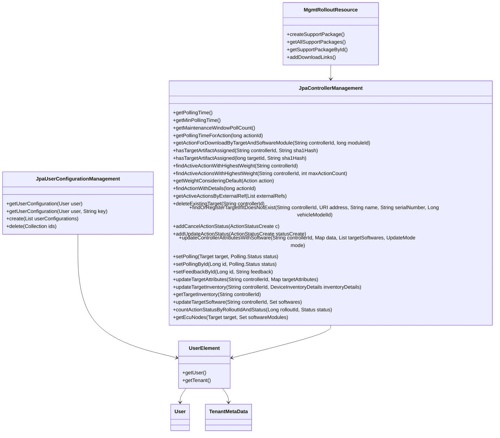

```mermaid
classDiagram
    class MgmtRolloutResource {
        +createSupportPackage()
        +getAllSupportPackages()
        +getSupportPackageById()
        +addDownloadLinks()
    }

    class JpaUserConfigurationManagement {
        +getUserConfiguration(User user)
        +getUserConfiguration(User user, String key)
        +create(List<UserConfigurationDTO> userConfigurations)
        +delete(Collection<Long> ids)
    }

    class JpaControllerManagement {
        +getPollingTime()
        +getMinPollingTime()
        +getMaintenanceWindowPollCount()
        +getPollingTimeForAction(long actionId)
        +getActionForDownloadByTargetAndSoftwareModule(String controllerId, long moduleId)
        +hasTargetArtifactAssigned(String controllerId, String sha1Hash)
        +hasTargetArtifactAssigned(long targetId, String sha1Hash)
        +findActiveActionWithHighestWeight(String controllerId)
        +findActiveActionsWithHighestWeight(String controllerId, int maxActionCount)
        +getWeightConsideringDefault(Action action)
        +findActionWithDetails(long actionId)
        +getActiveActionsByExternalRef(List<String> externalRefs)
        +deleteExistingTarget(String controllerId)
        +findOrRegisterTargetIfItDoesNotExist(String controllerId, URI address, String name, String serialNumber, Long vehicleModelId)
        +addCancelActionStatus(ActionStatusCreate c)
        +addUpdateActionStatus(ActionStatusCreate statusCreate)
        +updateControllerAttributesWithSoftware(String controllerId, Map<String, String> data, List<SoftwareOfTarget> targetSoftwares, UpdateMode mode)
        +setPolling(Target target, Polling.Status status)
        +setPollingById(Long id, Polling.Status status)
        +setFeedbackById(Long id, String feedback)
        +updateTargetAttributes(String controllerId, Map<String, String> targetAttributes)
        +updateTargetInventory(String controllerId, DeviceInventoryDetails inventoryDetails)
        +getTargetInventory(String controllerId)
        +updateTargetSoftware(String controllerId, Set<TargetSoftware> softwares)
        +countActionStatusByRolloutIdAndStatus(Long rolloutId, Status status)
        +getEcuNodes(Target target, Set<String> softwareModules)
    }

    class UserElement {
        +getUser()
        +getTenant()
    }

    MgmtRolloutResource --> JpaControllerManagement
    JpaUserConfigurationManagement --> UserElement
    JpaControllerManagement --> UserElement
    UserElement --> User
    UserElement --> TenantMetaData
```
